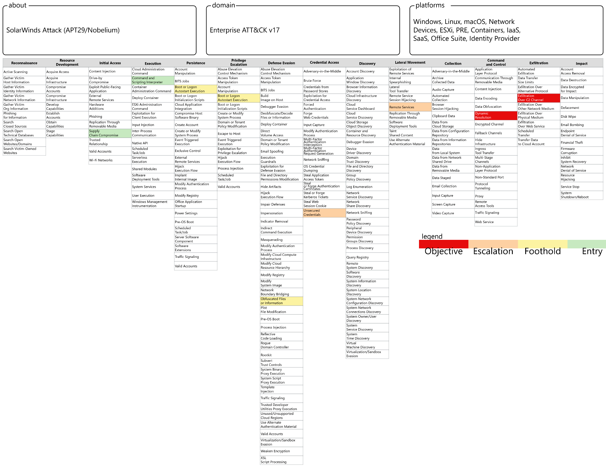

# 
The SolarWinds Supply Chain Attack

#### 
 #### <i>Overview</i>
><i> This report analyzes the 2020 SolarWinds supply chain compromise, a landmark cyber‑espionage campaign attributed to APT29 (Nobelium).  It examines the attack lifecycle from the compromise of SolarWinds’ build environment to the deployment of SUNBURST, lateral movement, Golden SAML abuse, and cloud exfiltration. The report maps observed behaviors to MITRE ATT&CK, evaluates operational impact, and provides technical and policy recommendations for strengthening supply chain security and Zero Trust adoption.</i>

***

<table><i>Critical Incident Data Points</i>
<tr><th>Key Fact</th><th>Detail</th></tr>
<tr><td>Incident</td><td>SolarWinds Supply Chain Attack</td></tr>
<tr><td>Threat Actor</td><td>APT29 / Nobelium (SVR)</td></tr>
<tr><td>Year</td><td>2020</td></tr>
<tr><td>Initial Vector</td><td>Compromised SolarWinds Orion build system</td></tr>
<tr><td>Impacted Orgs</td><td>~18,000 (government + private sector)</td></tr>
<tr><td>Primary Malware</td><td>SUNBURST</td></tr>
<tr><td>Secondary Payloads</td><td>TEARDROP, RAINDROP</td></tr>
<tr><td>Key Techniques</td><td>Supply chain compromise, Golden SAML</td></tr>
<tr><td>Primary Objective</td><td>Espionage / Data Exfiltration</td></tr>
<tr><td>Frameworks Used</td><td>MITRE ATT&CK, Cyber Kill Chain</td></tr>
</table>

## 1.0 Executive Summary

The 2020 SolarWinds supply chain attack stands as one of the most significant and sophisticated cyber-espionage campaigns in modern history, compromising thousands of organizations globally, including multiple branches of the U.S. federal government. This operation is attributed to a highly skilled threat actor, identified by the United States government as the Russian Foreign Intelligence Service (SVR) and tracked by the cybersecurity community as Nobelium or APT29. The attackers executed a patient and clandestine operation that began with the infiltration of SolarWinds' software build environment in late 2019.

The central mechanism of the attack involved injecting a malicious backdoor, designated **SUNBURST**, into a legitimate Dynamic Link Library (DLL) file within the SolarWinds Orion Platform. This trojan update, digitally signed with a valid certificate, was subsequently distributed to approximately 18,000 customers between March and June 2020. Following installation, the SUNBURST malware remained dormant before establishing contact with a command-and-control (C2) server. For a select subset of high-value targets, the threat actor deployed secondary payloads, such as **TEARDROP** and **RAINDROP**, to facilitate deeper network penetration, lateral movement, and data exfiltration.

The primary consequence of the breach was widespread espionage, leading to the theft of sensitive data from government and corporate networks. The incident exposed critical vulnerabilities within the global software supply chain, demonstrating how a single compromised vendor can serve as a pivot point for thousands of downstream intrusions. The response was a coordinated effort among cybersecurity firms and government agencies, most notably the Cybersecurity and Infrastructure Security Agency (CISA), which issued an emergency directive to mitigate the threat.

Key findings from this analysis underscore the inadequacy of traditional perimeter-based security models and affirm the critical need for a **Zero Trust architecture**. Accordingly, recommendations focus on strengthening supply chain security through the implementation of **Software Bills of Materials (SBOMs)**, the enforcement of rigorous code integrity practices, and the enhancement of privileged access monitoring.

---

## 2.0 Introduction

### 2.1 Background of the Affected Organization

SolarWinds, Inc. is a prominent American technology corporation that develops enterprise‑grade software for information technology (IT) infrastructure management. Since its founding in 1999, the company has become a leading provider of tools for network monitoring, systems management, and cybersecurity. Its flagship product, the **Orion Platform**, is an integrated suite designed to offer a comprehensive, single‑pane‑of‑glass view for managing an organization's entire IT environment.

By 2020, the Orion Platform's powerful capabilities and deep integration had made it a trusted solution for a vast customer base, including a majority of Fortune 500 companies and numerous high‑profile U.S. federal agencies. Notable clients included:

- Department of Defense  
- Department of State  
- NASA  
- Department of Homeland Security  
- Executive Office of the President  

This established trust, coupled with the Orion Platform's requirement for high‑level administrative privileges within client networks, rendered SolarWinds an exceptionally valuable target for a supply chain compromise.

### 2.2 Overview of its Network Infrastructure

The SolarWinds Orion Platform is predicated on a **client‑server architecture**, typically installed on‑premises within a customer's network. From a central server, it utilizes protocols such as:

- SNMP  
- WMI  
- ICMP  

to monitor and manage thousands of network endpoints.

To perform these functions, the Orion server and its associated service accounts require **privileged credentials**, often at the level of a domain administrator.

The attack vector did not directly target customer networks but instead focused on **SolarWinds' software development and distribution pipeline**, including:

- Source code repository  
- Build servers  
- Code‑signing infrastructure  
- Update distribution servers  

The threat actor infiltrated this pipeline, enabling the injection of malicious code into an Orion software library prior to compilation, signing, and distribution.

---

## 3.0 Incident Description

### 3.1 How the Breach Occurred

The SolarWinds compromise was executed as a **multi‑stage operation**, notable for its patience and stealth. Forensic analysis indicates:

- Initial infiltration occurred as early as **September 2019**  
- Attackers conducted reconnaissance on the build pipeline  
- A **test injection** of harmless code validated their access  
- SUNBURST was later injected into the Orion DLL  
- Trojanized updates were distributed between **March–June 2020**  
- SUNBURST remained dormant for up to **two weeks**  
- It then contacted a C2 domain generated via a DGA  
- Only a small subset of high‑value victims received second‑stage payloads  

The intrusion remained undetected until **December 2020**, when FireEye discovered anomalous activity and traced it back to the compromised Orion software.

### 3.2 Attack Methods and Tools Used

#### ● SUNBURST  
The primary backdoor, featuring:

- Dormancy period to evade detection  
- C2 communication mimicking legitimate Orion API traffic  
- System reconnaissance  
- Ability to deploy secondary payloads  

#### ● TEARDROP & RAINDROP  
Second‑stage, in‑memory droppers used to deploy **Cobalt Strike BEACON**.

#### ● Golden SAML / Forged Tokens  
After compromising an ADFS server, attackers stole the **token‑signing certificate**, enabling:

- Forged SAML tokens  
- Cloud resource access (e.g., Microsoft 365)  
- MFA bypass  
- Privilege escalation and lateral movement  

---

## 4.0 MITRE ATT&CK Mapping

The following table maps observed threat actor behaviors to MITRE ATT&CK techniques.

| MITRE Tactic        | Technique ID | Technique Name                                      | Description in SolarWinds Attack                                      |
|---------------------|--------------|------------------------------------------------------|------------------------------------------------------------------------|
| Initial Access      | T1195.002    | Supply Chain Compromise                              | Trojanized Orion update delivered to customers.                        |
| Execution           | T1059.001    | Command & Scripting Interpreter: PowerShell          | Used for in‑memory execution and second‑stage payload deployment.      |
| Persistence         | T1547        | Boot or Logon Autostart Execution                    | Malicious DLL loaded by legitimate SolarWinds service.                 |
| Privilege Escalation| T1548.002    | Abuse Elevation Control Mechanism: Bypass UAC        | Executed commands with elevated privileges.                            |
| Defense Evasion     | T1027        | Obfuscated Files or Information                      | C2 traffic disguised as Orion API calls.                               |
| Credential Access   | T1552.004    | Unsecured Credentials: Private Keys                  | Theft of ADFS token‑signing certificate.                               |
| Lateral Movement    | T1021.001    | Remote Services: Remote Desktop                      | Used for movement between systems.                                     |
| Command & Control   | T1071.001    | Web Protocols                                        | C2 communications over HTTP/HTTPS.                                     |
| Exfiltration        | T1041        | Exfiltration Over C2 Channel                         | Stolen data transmitted through established C2 channel.                |

---

## 5.0 Network Diagram

The diagram below provides a high‑level illustration of the attack path, commencing with the initial compromise of the SolarWinds build environment and culminating in the exfiltration of data from a victim's cloud services. The victim's Orion server is the key pivot point, serving as the conduit from the initial supply chain compromise to deep internal and cloud‑based access. The diagram shows the infiltration vector, the C2 communication channel, and the lateral movement path from the Orion server to critical assets such as a Domain Controller and ADFS server, and finally to cloud resources.

---

## 6.0 Impact Analysis

### 6.1 Data Compromised

The primary objective of the SolarWinds attack was espionage, with the threat actor selectively targeting organizations to exfiltrate sensitive data. High‑profile victims included:

- U.S. Department of the Treasury  
- U.S. Department of Commerce  
- U.S. Department of Homeland Security  
- Microsoft  
- FireEye  

The attackers primarily sought electronic communications and documents related to government policy, contracts, and intelligence matters.

### 6.2 Financial and Reputational Impact

The financial and reputational consequences were severe:

- SolarWinds’ stock price dropped by approximately **40%**  
- Tens of millions of dollars were spent on incident response and remediation  
- SolarWinds’ reputation as a trusted vendor suffered significant damage  

Victim organizations incurred substantial costs for:

- Forensic investigations  
- System remediation  
- Security enhancements  
- Legal and regulatory compliance  

### 6.3 Legal and Regulatory Implications

The breach triggered a major U.S. government response, including:

- Multiple congressional hearings  
- A 2021 Presidential Executive Order on Improving the Nation’s Cybersecurity  
- Mandatory SBOM requirements for federal software procurement  
- An SEC investigation into SolarWinds’ internal security controls and disclosures  

---

## 7.0 Response and Mitigation

The response to the SolarWinds attack required coordinated action across the public and private sectors.

Key elements included:

- **FireEye’s discovery** of the intrusion, which initiated global awareness  
- **CISA Emergency Directive 21‑01**, ordering federal agencies to disconnect affected Orion systems  
- **SUNBURST killswitch**, executed by Microsoft, FireEye, and GoDaddy by seizing control of the primary C2 domain  
- **SolarWinds’ release of patched Orion versions**  
- **Massive community‑driven threat intelligence sharing**, enabling rapid detection and remediation  

---

## 8.0 Lessons Learned

The SolarWinds incident exposed several critical deficiencies in modern cybersecurity practices.

#### ● The Criticality of the Software Supply Chain  
Organizations depend on the security of their vendors, making the software supply chain a vast and often unmonitored attack surface.

#### ● The Inadequacy of Code Signing Alone  
The attackers used a valid digital certificate to sign malicious code, proving that code signing cannot guarantee integrity if the build environment is compromised.

#### ● The Failure of Perimeter‑Based Defenses  
The attack originated from a trusted update and bypassed traditional perimeter controls, reinforcing the need for Zero Trust and “assume breach” principles.

#### ● Deficiencies in Monitoring and Visibility  
Insufficient monitoring of the build environment and privileged accounts allowed the attackers to operate undetected for months.

---

## 9.0 Recommendations

Based on the preceding analysis, the following recommendations are proposed to mitigate the risk of similar incidents.

### 9.1 Technical Proposals

#### ● Adoption of a Zero Trust Security Model  
Implement network segmentation, least privilege, and continuous identity verification.

#### ● Hardening of the Build Environment  
Apply strict access controls, robust monitoring, and automated integrity checks across all development and build pipelines.

#### ● Implementation of Privileged Access Monitoring  
Deploy tools to monitor privileged account activity, especially for identity systems such as ADFS.

### 9.2 Policy and Procedural Proposals

#### ● Mandate for Software Bill of Materials (SBOM)  
Require vendors to provide SBOMs to enable component tracking and vulnerability management.

#### ● Strengthening of Third‑Party Risk Management  
Use security questionnaires, independent audits, and contractual requirements to assess vendor security posture.

#### ● Enhancement of Interagency Information Sharing  
Promote deeper collaboration between government and private sector entities to improve detection and response to nation‑state threats.

---

## 10.0 References

- CISA. (2020, December 13). *Active exploitation of SolarWinds software.*  
- CISA. (2021, January 7). *Supply chain compromise: FireEye & SolarWinds Orion.*  
- CISA. (2020, December 17). *Advanced persistent threat compromise of government agencies… (AA20‑352A).*  
- Government Accountability Office. (2021). *Federal response to SolarWinds and Microsoft Exchange incidents.*  
- Microsoft. (2020, December 18). *Analyzing Solorigate…*  
- Microsoft. (2021, January 20). *Deep dive into the Solorigate second‑stage activation…*  
- Microsoft. (2021, February 18). *Microsoft internal Solorigate investigation — Final update.*  
- Microsoft. (2020, December 21). *Solorigate resource center.*  
- NERC. (2021). *SolarWinds and related supply chain compromise white paper.*  
- ODNI. (2021). *SolarWinds Orion software supply chain attack.*  
- Senate Select Committee on Intelligence. (2021). *Hearing on the hack of U.S. networks…*  
- Zetter, K. (2021). *The untold story of the boldest supply‑chain hack ever.* Wired.
